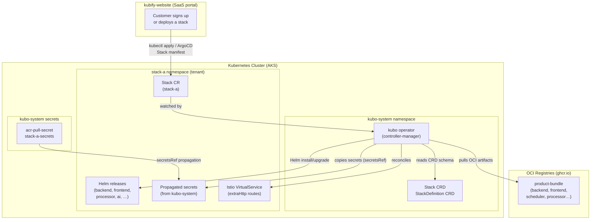
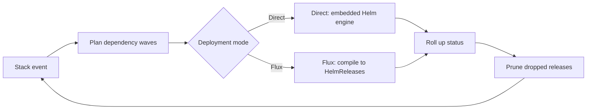

# Kubo Architecture

## The reconcile loop

Every Stack change — a new bundle tag, a values override, a pause, or a manual reconcile
trigger — re-enters the same loop:

- **Dependency waves** — components are ordered topologically over `dependsOn` (release must
  exist) and `dependsOnReady` (workloads must be Running and Ready) before deployment.
- **Pruning** — releases dropped from the spec are uninstalled; nothing lingers.
- **Status** — per-component phase, revision, and conditions roll up into the Stack CR; the
  operator portal renders this directly.

## Deployment modes

- **Direct** — the operator's embedded Helm engine installs and upgrades releases itself.
  Simplest path, full per-component status.
- **Flux** — components compile to Flux HelmReleases; helm-controller executes. Use when the
  cluster standardizes on Flux.

## Shared operators

Cluster-scoped operators (Vault, Spark, Istio, …) install once into a shared operators
namespace and watch every tenant namespace; tenant charts never duplicate them.

## Where everything lives

| Location | Contents | Role |
|---|---|---|
| kubo-system | operator, Stack + StackDefinition CRDs, seeded secrets, pull secrets | control plane — watches every Stack, propagates credentials |
| operators ns | Vault, Spark, Istio, cert-manager, … | cluster-scoped services, installed once, watching all tenants |
| tenant ns | Stack CR, Helm releases, propagated secrets, Istio VirtualServices | the running product — one namespace per tenant |
| OCI registry | product bundles (charts + images + values, versioned) | the delivery artifact — portable across clusters and orgs |
