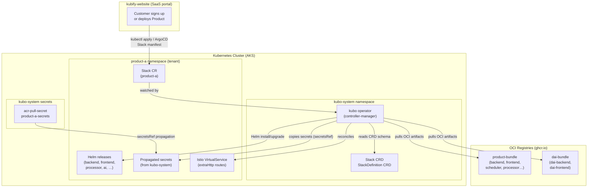

# Kubo Architecture

```mermaid
flowchart TD
    subgraph Website["kubify-website (SaaS portal)"]
        WEB["Customer signs up\nor deploys Product"]
    end

    subgraph K8s["Kubernetes Cluster (AKS)"]
        subgraph KuboNS["kubo-system namespace"]
            OP["kubo operator\n(controller-manager)"]
            CRDS["Stack CRD\nStackDefinition CRD"]
        end

        subgraph TenantNS["product-a namespace (tenant)"]
            STACK["Stack CR\n(product-a)"]
            HELM["Helm releases\n(backend, frontend,\nprocessor, ai, …)"]
            SECRETS["Propagated secrets\n(from kubo-system)"]
            VS["Istio VirtualService\n(extraHttp routes)"]
        end

        subgraph KuboSys["kubo-system secrets"]
            PULL["acr-pull-secret\nproduct-a-secrets"]
        end
    end

    subgraph OCI["OCI Registries (ghcr.io)"]
        FBUNDLE["product-bundle\n(backend, frontend,\nscheduler, processor…)"]
        DAIBUNDLE["dai-bundle\n(dai-backend,\ndai-frontend)"]
    end

    WEB -->|"kubectl apply / ArgoCD\nStack manifest"| STACK
    STACK -->|"watched by"| OP
    OP -->|"reads CRD schema"| CRDS
    OP -->|"pulls OCI artifacts"| FBUNDLE
    OP -->|"pulls OCI artifacts"| DAIBUNDLE
    OP -->|"Helm install/upgrade"| HELM
    OP -->|"copies secrets (secretsRef)"| SECRETS
    OP -->|"reconciles"| VS
    PULL -->|"secretsRef propagation"| SECRETS
```
